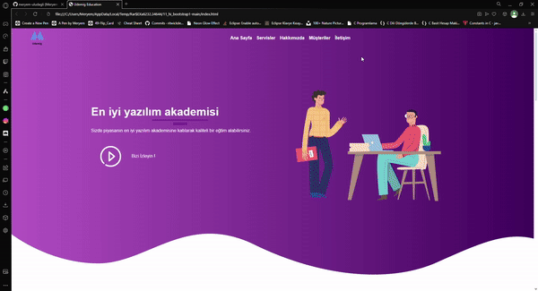

# 🏫Udemig Academy:

This is a responsive web page for "Udemig Academy," a mock online learning platform, built using Bootstrap. The page showcases a modern and user-friendly design, ensuring a great experience across all devices.

##

# 🧭Features: 

- Responsive Design: Optimized for all screen sizes, including desktops, tablets, and mobile devices.

- Bootstrap Components: Utilizes Bootstrap's grid system, navigation bar, cards, buttons, and more for a clean and consistent look.

- Footer: Includes social media links and additional information.

##

# 🏜️Preview:

# Udemig-Academy
